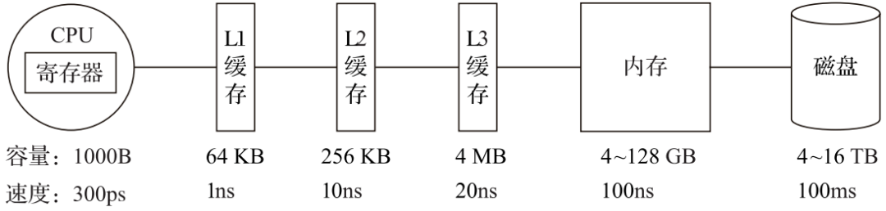

# 1. 什么是ClickHouse?

引用官网中文文档中的介绍：https://clickhouse.com/docs/zh/

> ClickHouse是一个用于联机分析(OLAP)的列式数据库管理系统(DBMS)

注意，它强调的是列式数据库。传统的数据库如oracle、mysql、postgresql等都是行式数据库，一条记录即为一行，而一行的数据在磁盘上是存储在一起的。

假设有如下表：

| Row | ID | Name | Age |
|----|----|------|-----|
| 0 | 1  | 张三   | 16  |
| 1 | 2  | 李四   | 20  |
| N | 3  | 王五   | 18  |

 在 **行式数据库** 中，则是一行存储在一起，比如第一条数据 ID=1，Name=张三，Age=16，被存储在一起（如果你了解数据库的聚集索引或者称为主键索引，你就知道在BTree中叶子节点存储一条记录的所有信息）

而在 **列式数据库** 中，则是同一列的数据据存储在一起，不同列的数据单独存储，比如表中的第一列数据ID=1，ID=2，ID=3的这一列被存储在一起，其他列被分开，这便是列式数据库的存储方式。

这样做有什么好处呢？下面将介绍到。

# 2. clickhouse如何实现高性能的？

### 1）列式存储和数据压缩 

列式存储上面已经介绍过了，下面介绍一下数据压缩，压缩的本质是按照一定步长对数据进行匹配扫描，当发现重复部分的时候就进行编码转换，比如有下面一段字符：

压缩前：
```
abcdefghijk_bcdefghijk
```

压缩后：

```
abcdefghijk_(11,10)
```
将重复的字符 bcdefghijk 压缩成(11,10)这样的编码，表示从下划线向前移动11个字符为会匹配到10个重复的内容，当然真实的压缩算法肯定要比这个复杂的多，这里只是简单说明。

所以在数据压缩的过程中重复的数据越多，压缩率就越高，那么在列式存储中，同一列都是相同类型的数据，重复的可能性也就越高，压缩后的数据体量也就越小。

### 2） 多核心并行处理，多服务器分布式处理

 **多核心并行处理** 

ClickHouse会使用服务器上一切可用的资源，从而以最自然的方式并行处理大型查询

ClickHouse将数据划分为多个partition，每个partition再进一步划分为多个index granularity，然后通过多个CPU核心分别处理其中的一部分来实现并行数据处理。

在这种设计下，单条Query就能利用整机所有CPU。极致的并行处理能力，极大的降低了查询延时

 **多服务器分布式处理** 

在ClickHouse中，数据可以保存在不同的shard上，每一个shard都由一组用于容错的replica组成，查询可以并行地在所有shard上进行处理


### 3） 向量化执行引擎

为了高效的使用CPU，数据不仅仅按列存储，同时还按向量(列的一部分)进行处理，这样可以更加高效地使用CPU。

向量化执行，可以简单地看作一项消除程序中循环的优化，比如我们要循环打印1~8的数字，我们可能会写一个for循环，在一台电脑上循环8次打印数字，而在向量化执行中，则是同时8台电脑一次调用打印方法，这个例子可能不太恰当，大致是这个意思。

> 以下内容参考自 https://cloud.tencent.com/developer/article/1842221  

为了实现向量化执行，需要利用CPU的SIMD指令。SIMD的全称是Single Instruction Multiple Data，即用单条指令操作多条数据。现代计算机系统概念中，它是通过数据并行以提高性能的一种实现方式 ( 其他的还有指令级并行和线程级并行 )，它的原理是在CPU寄存器层面实现数据的并行操作。

在计算机系统的体系结构中，存储系统是一种层次结构。典型服务器计算机的存储层次结构下图所示。一个实用的经验告诉我们，存储媒介距离CPU越近，则访问数据的速度越快



从上图中可以看到，从左向右，距离CPU越远，则数据的访问速度越慢。从寄存器中访问数据的速度，是从内存访问数据速度的300倍，是从磁盘中访问数据速度的3000万倍。所以利用CPU向量化执行的特性，对于程序的性能提升意义非凡。

ClickHouse目前利用SSE4.2指令集实现向量化执行 SSE是一种SIMD指令集。

关于clickhouse的性能方面，可以参考它官网做的测试 https://benchmark.clickhouse.com/ 


# 3. clickhouse的缺点


参考：

https://cloud.tencent.com/developer/article/1842221

https://clickhouse.com/docs/zh/introduction/distinctive-features

