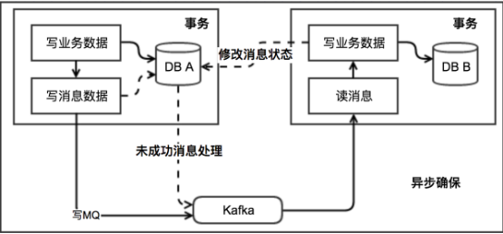

随着互联网的发展，单数据库单系统时代已经不能应对庞大的数据量，业务被拆分成多个模块，每个模块都有自己的数据库，而模块与模块之间的互相调用，也产生了一系列的问题。以下是关于分布式系统中的分布式事务问题相关内容。

分布式事务：一次大的操作分为不同的小操作由不同的分布式系统完成，针对这一个操作，其执行结果是要么全部的小操作都执行完成，要么全部回滚到最初状态，这就是分布式事务。本质就是保证不同数据库上的数据一致性。

在本地数据库上的操作我们能保证 ACID 的特性，但是在分布式系统中却存在问题。

 ### cap理论

在一个分布式系统（指互相连接并共享数据的节点的集合）中，当涉及读写操作时，只能保证一致性（Consistence）、可用性（Availability）、分区容错性（Partition Tolerance）三者中的两个，另外一个必须被牺牲。

一致性(C): 一致性指数据在多个副本之间能够保持一致性的特性。比如当某个数据被写入某个节点后，那么所有的节点获取该值时应该时最新的，而且是一致的。这里是强一致性，一旦写入则所有节点都查询到一致的数据。

可用性(A): 这里是指高可用性，即系统提供的服务必须一直处于可用的状态，也就是读、写永远都能成功，即服务一直可用

分区容错性(P): 容错性,那就是网络节点之间无法通信的情况下，节点被隔离，产生了网络分区， 整个系统仍然是可以工作的。

然而在分布式的环境下，网络无法做到100%可靠，所以分区容错性是前提，然而在选择了分区容错性的前提下，一致性和可用性只能二选一，不能同时保证；

假如系统之间产生了隔离，要保证整个系统仍然可用，假设有A、B、C三个节点，之间产生了隔离

假设这个时候保证一致性，这个时候如果A节点有数据写入，要保证ABC所有的节点该数据都一致，那么就不能保证可用性，因为要等到这个数据同步到其他节点保证强一致性，必须要等到ABC节点之间的网络隔离修复之后才能执行下去，这样的话，这个写入请求会一致不成功（即不能继续提供服务），直到网络恢复之后。

假设选择了可用性，即使有数据写入服务仍然可用，那么就不能保证强一致性，比如A节点有数据写入，为了保证可用性，那么这次请求可以成功，但是ABC之间使隔离的，那么它们之间的数据就不可能是一致的，所以一致性就无法保证了。

总结CAP定理中，再保证分区容错性(P)的前提下，要么选择一致性(C)，要么选择可用性(A)，即CP或AP。

### Base 理论

BASE理论是对CAP理论的延伸,核心思想是 即使无法做到强一致性，可以通过一些软状态和最终一致性的方式，来尽量达到一致性的要求。BASE是Basically Available（基本可用）、Soft state（软状态）和Eventually consistent（最终一致性）三个短语的缩写

基本可用：指分布式系统在出现故障的时候，允许损失部分可用性，保证核心可用

软状态： 软状态是指允许系统存在中间状态，而该中间状态不会影响系统整体可用性。分布式存储中一般一份数据至少会有三个副本，允许不同节点间副本同步的延时就是软状态的体现。

最终一致性：各个节点的数据不一致，可以通过一系列的措施来进行更新补偿，最终达到一致性的要求。最终一致性强调的是所有的数据副本，在经过一段时间的同步之后，最终都能够达到一个一致的状态，不需要实时保证系统数据的强一致。

### 分布式事务解决方案

由于分布式事务方案，无法做到完全的ACID的保证，没有一种完美的方案能够解决掉所有业务问题。因此在实际应用中，会根据业务的不同特性，选择最适合的分布式事务方案

#### 基于XA协议的两阶段提交方案（2PC）

XA协议由Tuxedo首先提出的，并交给X/Open组织，作为资源管理器（RM）与事务管理器（TM）的接口标准。目前，Oracle、Informix、DB2和Sybase等各大数据库厂家都提供对XA的支持。XA协议采用两阶段提交方式来管理分布式事务。XA接口提供资源管理器与事务管理器之间进行通信的标准接口。

XA一共分为两阶段：

第一阶段（prepare）：即所有的参与者RM准备执行事务并锁住需要的资源。参与者ready时，向TM报告已准备就绪。

第二阶段 (commit/rollback)：当事务管理者(TM)确认所有参与者(RM)都ready后，向所有参与者发送commit命。

如果有任何一个参与者prepare失败，那么TM会通知所有完成prepare的参与者进行回滚。

优点： 简单易理解，开发较容易 

缺点：对资源进行了长时间的锁定，并发度低，它是一种尽量保证强一致性的分布式事务，因此它是同步阻塞的，而同步阻塞就导致长久的资源锁定问题，总体而言效率低

目前主流的数据库基本都支持XA事务，包括mysql、oracle、sqlserver、postgresql

#### TCC方案

TCC即Try-Confirm-Cancel 分为3个阶段：

Try 阶段：尝试执行业务，完成所有业务检查（一致性），预留必须业务资源（准隔离性）

Confirm 阶段：真正执行业务，不作任何业务检查，只使用Try阶段预留的业务资源，Confirm操作满足幂等性，Confirm 失败后需要进行重试。

Cancel 阶段: 取消执行，释放 Try 阶段预留的业务资源。Cancel 阶段的异常和 Confirm 阶段异常处理方案基本上一致，要求满足幂等设计

优点：

- 解决了 XA 协议的协调者单点故障问题，由主业务方发起并控制整个业务活动，业务活动管理器也变成多点，引入集群。
- 控制资源锁的粒度变小，不会锁定整个资源，整体性能提高了

缺点：

- 对服务的侵入性强，服务的每个事务都必须实现try，confirm，cancel等3个方法，开发成本高，维护改造的成本也高
- 为了达到事务的一致性要求，try，confirm、cancel接口必须实现等幂性操作（定时器+重试）

https://github.com/changmingxie/tcc-transaction 这是java实现的tcc开源项目 感兴趣的可以看一下

### 消息队列（本地消息）
将需要分布式处理的任务通过消息的方式来异步确保执行。它让本地消息表与业务数据表处于同一个数据库中，这样就能利用本地事务来满足事务特性。具体做法是在本地事务中插入业务数据时，同时插入一条消息数据。之后再做后续业务操作，如果操作成功，则删除该消息；如果失败则不断重试（通过定时扫描未成功处理的消息，进行重新发送，不断重试）。

本地事务保障消息和业务一定会写入数据库，此后的执行无论宕机还是网络推送失败，异步监听都可以进行后续处理，从而保障了消息一定会推到 MQ。

优点：

- 长事务仅需要分拆成多个任务，使用简单

缺点：

- 生产者需要额外的创建消息表，并对未成功的消息不断轮询
- 消费者的逻辑如果无法通过重试成功，那么还需要更多的机制，来回滚操作（长时间不成功，或者规定时间内步成功，则需要涉及一套回滚方案）

### 事务消息
利用本身带有事务的消息中间件完成（上面的本地消息方案中消息中间件本身无事务，或者没有使用消息中间件自带的事务功能）

在上述的本地消息表方案中，生产者需要额外创建消息表，还需要对本地消息表进行轮询，业务负担较重。

阿里开源的RocketMQ 4.3之后的版本正式支持事务消息，该事务消息本质上是把本地消息表放到RocketMQ上，解决生产端的消息发送与本地事务执行的原子性问题。

事务消息发送及提交：

- 准备消息，发送消息（half消息，对消费者不可见）
- 执行本地事务，如果成功则提交half消息，消费者可以收到该消息，如果失败则删除half消息
- 生产者提供会查接口，如果half消息长时间未删除或者提交，会查生产者的执行状态。

其优缺点基本与本地消息类似，只是生产者消息表由消息中间件提供。

#### Saga事务

其核心思想是将长事务拆分为多个本地短事务，由Saga事务协调器协调，如果正常结束那就正常完成，如果某个步骤失败，则根据相反顺序一次调用补偿操作。

参考:[分布式基础之CAP和BASE理论](https://www.jianshu.com/p/46b90dfc7c90)

[分布式事务最经典的七种解决方案](https://segmentfault.com/a/1190000040321750)