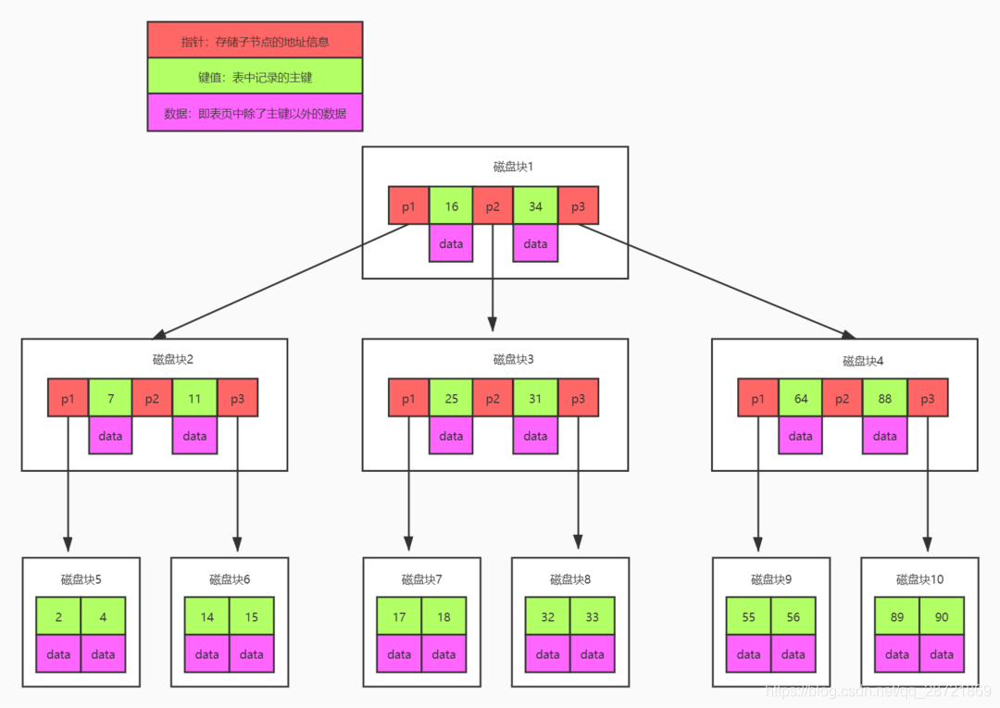
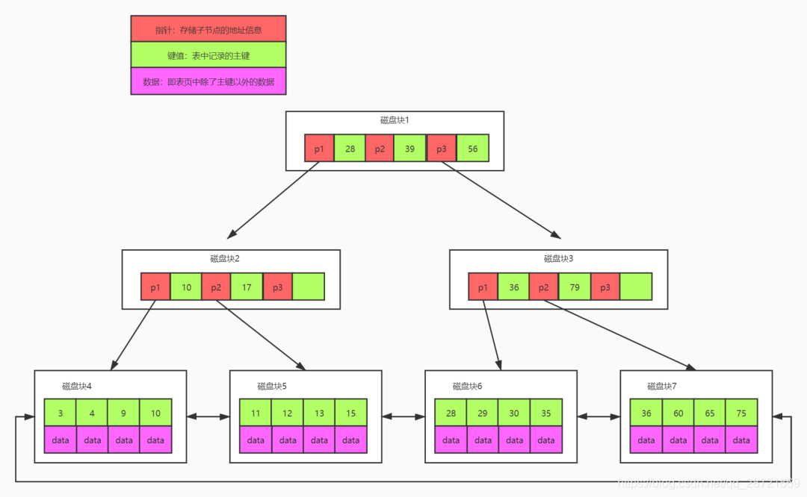
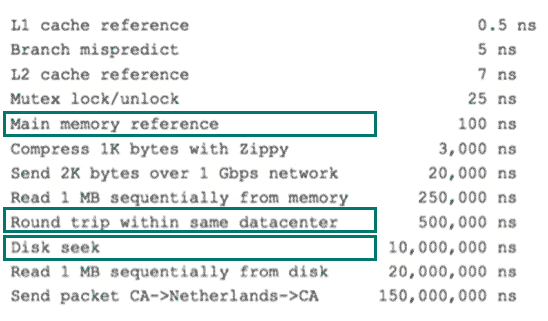
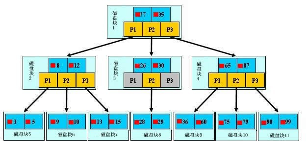

### 索结结构（方法）

 **Hash索引** ：对于每一行数据，存储引擎都会对所有的索引列的值计算一个哈希码存储在哈希表中。哈希索引只包含哈希值和行指针（指向实际的行数据），当有哈希冲突时，则会逐行比较符合查询条件的数据行。

 -  **优点** ：如果是等值查询，则效率非常高，时间复杂度为O(1)，例如：查询某个列等于某个值的时候，只需要计算这个列的hash码，就能快速定位到这行数据，效率当然很高。
 -  **缺点**：Hash索引的缺点也很明细，只支持等值比较查询如：=，in(),<=>(严格比较两个NULL值是否相等,两个操作码均为NULL时，其所得值为1；而当一个操作码为NULL时，其所得值为0)，不支持任何范围查询，因为它是计算索引列的哈希码存储的，范围查找就失去了意义，而且无法用于排序，同时它也不支持部分索引列匹配查找，比如多个索引列，只匹配其中的部分列是做不到的，因为它是将所有的索引列计算出一个哈希码。哈希索引只包含哈希值和行指针，所以不能使用覆盖索引。

总的来说，Hash索引只适合特定的场景，它的限制极多。

**BTree索引**：mysql中称为B+树索引（查看表的索引时，显示的索引类型是BTree，实际实现的是B+树），在介绍B+树之前先介绍一下B树（B树、BTree、B-Tree都是同一个概念，都称为BTree），B树是一种多路自平衡搜索树，它类似普通的二叉树，但是B树允许每个节点有更多的子节点（二叉树一个节点下最多两个节点，而B树下一个节点可以有超过两个的节点），特点是：

- 所有节点中即包含记录的索引key值和这条记录的所有数据，以及指向下一个节点的指针；
- 任何一条记录出现且只出现在一个节点中；
- 搜索可能在非叶子节点时就结束了（因为节点中包含这条记录的所有数据，查到某条记录可以直接返回）；

以下为BTree的结构图：

B+树是对B树的升级，非叶子节点只存储索引列和下一个节点的指针（不再存储数据了），叶子节点存储索引列和数据以及下一个节点的指针（叶子节点是相连的），以现实中的树木比喻说明就是，BTree更加繁茂，而B+树相对精简，以下为B+树的结构图：

那么为什么不用BTree而是用的B+树呢？见下面的问题。

参考：[一文看懂B TREE和B+TREE数据结构实现过程及数据存储结构](https://blog.csdn.net/qq_28721869/article/details/115803481)

### 为什么采用 B+树

为什么采用的是B+树，而不是B树或者平衡二叉树或者是红黑树
 
**B+树相对于B树：** 
- B+树非叶子节点只存储索引键和指针，相对B树来讲可以存储更多的索引键，这样的话B+树的深度也会更低，一次性读入内存的索引键也会更多，IO的次数也会变少，查询效率更高
- B+树的所有数据都存储在叶子节点上，如果要取数据的话，那么每次查询IO的次数都是相同的，也就是说查询是稳定的
- B+树叶子节点之间通过双向链表连接，可以很方便的进行范围查询
总结就是B+树比B树查询效率更高更稳定，而且方便范围查询。

 **B+树相对于平衡二叉树或红黑树：** 
- 平衡二叉树追求绝对平衡，条件比较苛刻，而红黑树是对平衡二叉树的弱实现，追求大致平衡，在与平衡二叉树的时间复杂度相差不大的情况下，保证每次插入最多只需要三次旋转就能达到平衡，实现起来也更为简单，然而不管是平衡二叉树还是红黑树它们的任一节点最多有两个子节点，假设使用平衡二叉树或红黑树作为索引结构，那么一个节点只能存储一个索引键和指针，在数据量非常大的情况下，平衡二叉树或红黑树的深度会变的更深，这就意味着查询需要更多的IO，这显然不能被接受。

### 索引原理

这里主要介绍以B+树实现索引的原理。上面关于B+树的介绍中，多次提到磁盘IO，有的文章中提到内存页、磁盘预读这些概念，这些都涉及到索引的实现原理。

为了保证数据的持久化，数据保存在磁盘上是必然的，而为了提高性能，每次又可以把部分数据读入内存来计算，然而 **访问磁盘的成本大概是访问内存的十万倍左右** 

> 以下内容引用自 美团技术博客-[MySQL索引原理及慢查询优化](https://tech.meituan.com/2014/06/30/mysql-index.html) 建议看一看

 **磁盘IO** ：从磁盘读取数据到内存称为一次磁盘IO，磁盘读取数据靠的是机械运动，每次读取数据花费的时间可以分为 **寻道时间、旋转延迟、传输时间** 三个部分，寻道时间指的是磁臂移动到指定磁道所需要的时间，主流磁盘一般在5ms以下；旋转延迟就是我们经常听说的磁盘转速，比如一个磁盘7200转，表示每分钟能转7200次，也就是说1秒钟能转120次，旋转延迟就是1/120/2 = 4.17ms；传输时间指的是从磁盘读出或将数据写入磁盘的时间，一般在零点几毫秒，相对于前两个时间可以忽略不计，那么访问一次磁盘的时间，即一次磁盘IO的时间约等于5+4.17 = 9ms左右，数据库有千百万条数据，每次9毫秒的时间，显然是个灾难。

 **磁盘预读** ：考虑到磁盘IO是非常高昂的操作，计算机操作系统做了一些优化，当一次IO时，不光把当前磁盘地址的数据，而是把相邻的数据也都读取到内存缓冲区内，因为局部预读性原理告诉我们，当计算机访问一个地址的数据的时候，与其相邻的数据也会很快被访问到。每一次IO读取的数据我们称之为一页(page)。具体一页有多大数据跟操作系统有关，一般为4k或8k，也就是我们读取一页内的数据时候，实际上才发生了一次IO，这个理论对于索引的数据结构设计非常有帮助。（这里的4k或8k指的是操作系统的页大小，而mysql有自己的页大小默认是16k，二者不是一个概念）

索引的原理：通过不断的缩小想要获得数据的范围来筛选出最终想要的结果，同时把随机的事件变成顺序的事件，也就是通过同一种查找方式来锁定数据

基于上面的理论，那么能不能设计出一种数据结构，使得 每次查找数据时把磁盘IO次数控制在一个很小的数量级，最好是常数数量级。那么我们就想到如果一个高度可控的多路搜索树是否能满足需求呢？就这样，b+树应运而生。

b+树的查找过程

如图所示，如果要查找数据项29，那么首先会把磁盘块1由磁盘加载到内存，此时发生一次IO，在内存中用二分查找确定29在17和35之间，锁定磁盘块1的P2指针，内存时间因为非常短（相比磁盘的IO）可以忽略不计，通过磁盘块1的P2指针的磁盘地址把磁盘块3由磁盘加载到内存，发生第二次IO，29在26和30之间，锁定磁盘块3的P2指针，通过指针加载磁盘块8到内存，发生第三次IO，同时内存中做二分查找找到29，结束查询，总计三次IO。真实的情况是，3层的b+树可以表示上百万的数据，如果上百万的数据查找只需要三次IO，性能提高将是巨大的，如果没有索引，每个数据项都要发生一次IO，那么总共需要百万次的IO，显然成本非常非常高。

b+树性质

1.通过上面的分析，我们知道IO次数取决于b+数的高度h，假设当前数据表的数据为N，每个磁盘块的数据项的数量是m，则有h=㏒(m+1)N，当数据量N一定的情况下，m越大，h越小；而m = 磁盘块的大小 / 数据项的大小，磁盘块的大小也就是一个数据页的大小，是固定的，如果数据项占的空间越小，数据项的数量越多，树的高度越低。这就是为什么每个数据项，即索引字段要尽量的小，比如int占4字节，要比bigint8字节少一半。这也是为什么b+树要求把真实的数据放到叶子节点而不是内层节点，一旦放到内层节点，磁盘块的数据项会大幅度下降，导致树增高。当数据项等于1时将会退化成线性表。

2.当b+树的数据项是复合的数据结构，比如(name,age,sex)的时候，b+数是按照从左到右的顺序来建立搜索树的，比如当(张三,20,F)这样的数据来检索的时候，b+树会优先比较name来确定下一步的所搜方向，如果name相同再依次比较age和sex，最后得到检索的数据；但当(20,F)这样的没有name的数据来的时候，b+树就不知道下一步该查哪个节点，因为建立搜索树的时候name就是第一个比较因子，必须要先根据name来搜索才能知道下一步去哪里查询。比如当(张三,F)这样的数据来检索时，b+树可以用name来指定搜索方向，但下一个字段age的缺失，所以只能把名字等于张三的数据都找到，然后再匹配性别是F的数据了， 这个是非常重要的性质，即索引的最左匹配特性。

参考:[MySQL索引原理及慢查询优化](https://tech.meituan.com/2014/06/30/mysql-index.html)

### 聚集索引、非聚集索引、覆盖索引，最左前缀匹配原则

 **聚集索引（主键索引）：** 以主键字段建立的索引我们称为聚集索引或者主键索引，其特点是：非叶子节点存储主键和指针，叶子节点存储主键和所有字段的值。一个表中只能拥有一个聚集索引。

**非聚集索引（普通索引）：** 不是表中的主键字段建立的索引，都称之为非聚集索引或者普通索引，其特点是：非叶子节点存储索引字段和指针，叶子节点存储索引字段和表的主键值。一个表中可以有多个非聚集索引。

 **覆盖索引** ： **非聚集索引** 查询时，如果要查询的字段刚好是非聚集索引的索引值，那么这个查询被称为覆盖索引，因为它不需要 **回表** 查询具体的数据。

假设有这样的一个数据表(user)，其中ID为主键：

| ID | NAME | AGE | SEX |
|----|------|-----|-----|
| 1  | 张三   | 20  | 1 |
| 2  | 李四   | 22  | 0 |
| 3  | 王五   | 23  | 1 |
| 4  | 孙六   | 22  | 0 |
| 5  | 赵七   | 23  | 0 |
| 6  | 王把   | 24  | 1 |

以 NAME 建立索引，则它是非聚集索引，当我们查询 select name from user where name='张三' 则被称为覆盖索引。而当我们查询 select * from user where name='张三' 这个过程它首先通过name索引查询到name='张三' 对应的主键值1 ，然后通过主键回表查询具体的数据。

 **最左前缀匹配原则：** 在有多个列的索引中(col1, col2, col3)，以最左边的为起点任何连续的索引都能匹配上，遇到范围查询(>、<、between、like)就会停止匹配，该索引的任何最左前缀都可以用于查询。比如当你有一个联合索引 (col1, col2, col3)，该索引的所有前缀为 (col1)、(col1, col2)、(col1, col2, col3)，包含这些列的所有查询都会使用该索引进行查询

### 什么情况下索引会失效