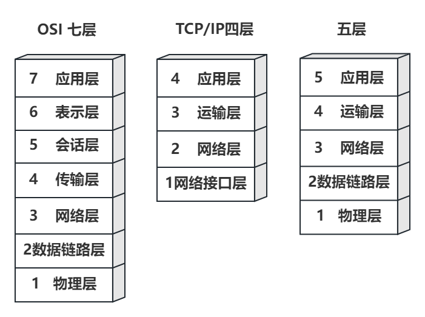
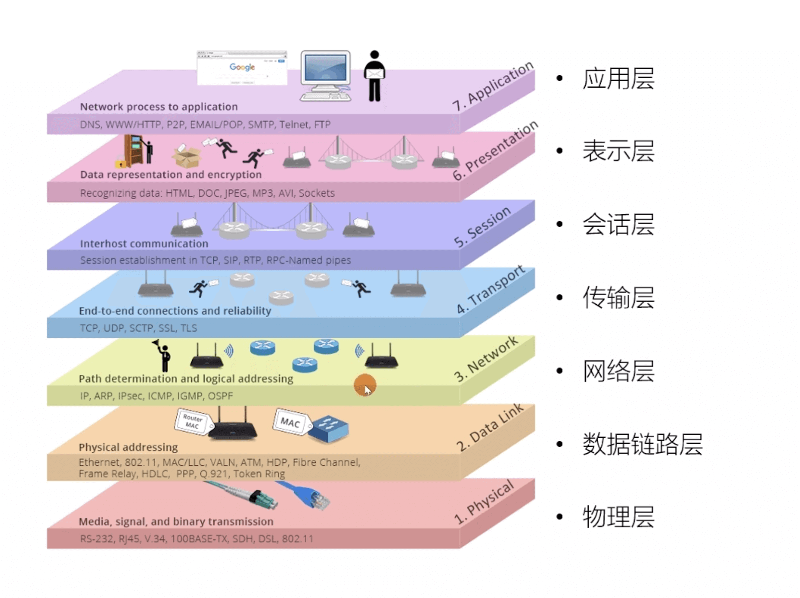
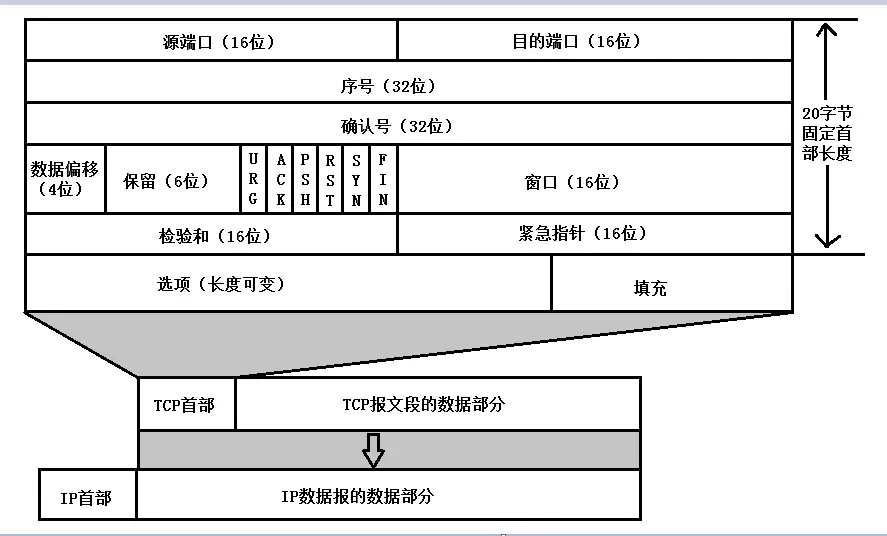
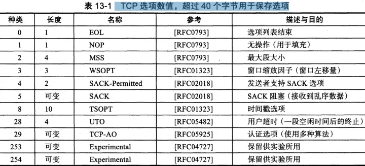
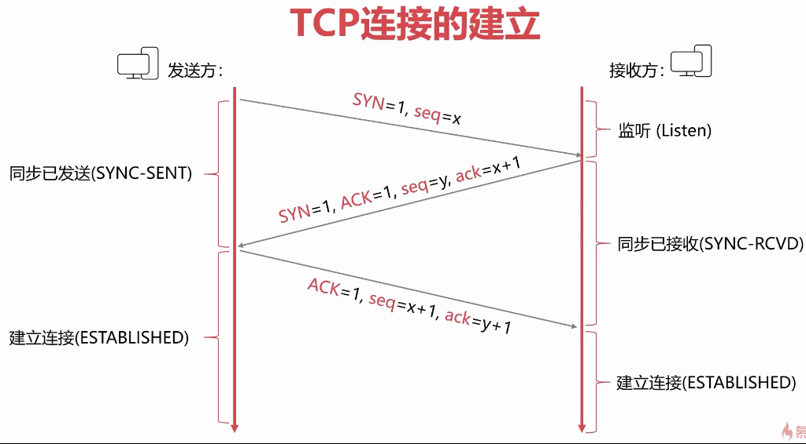
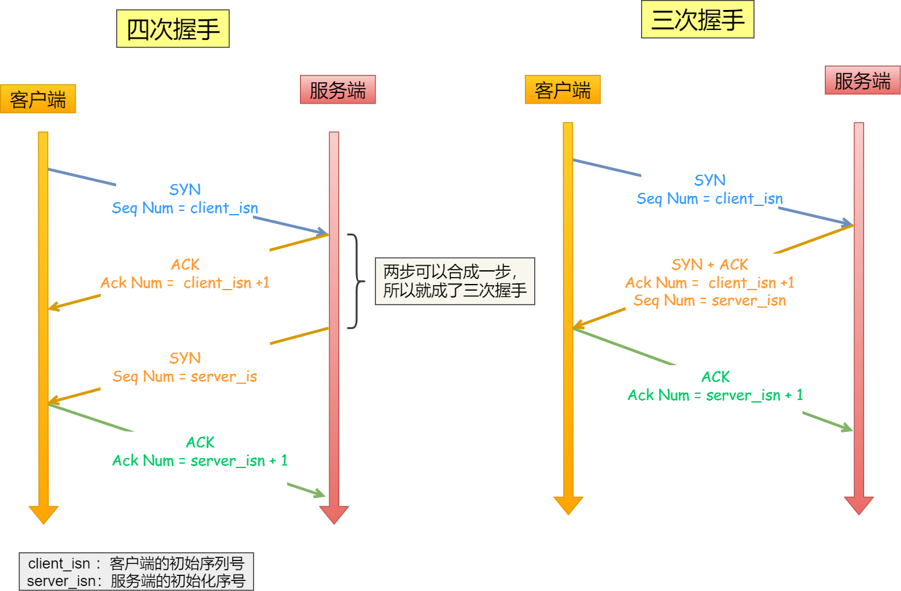
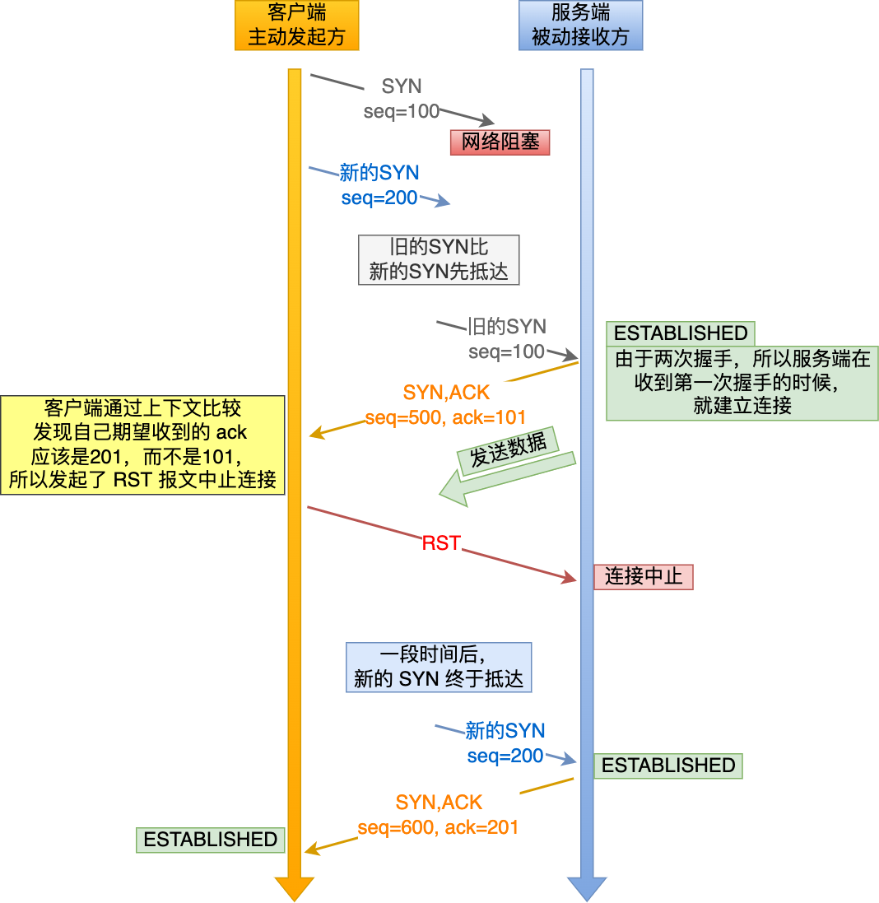
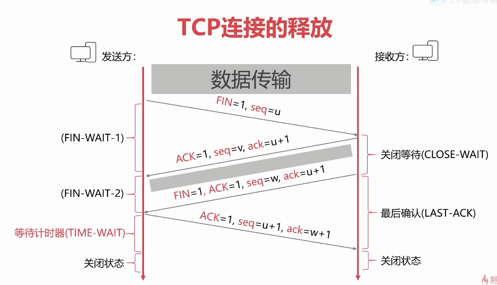
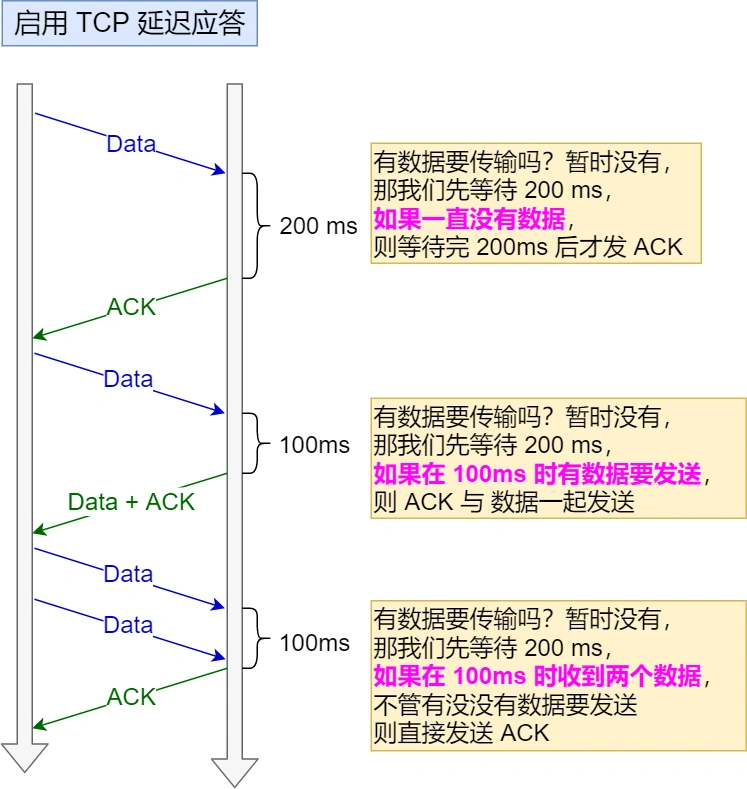
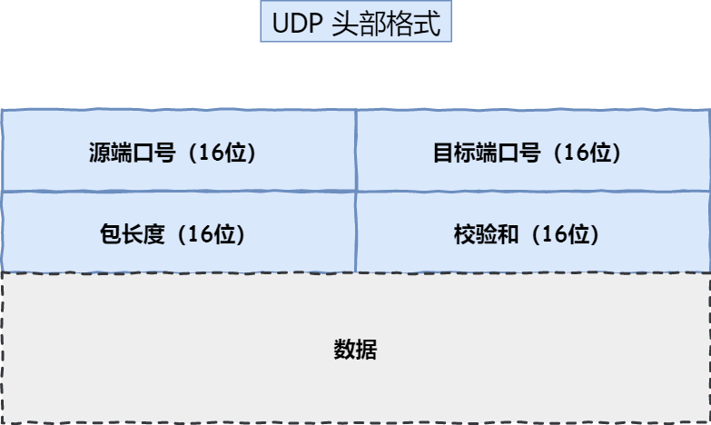

### 计算机网络七层体系结构（OSI七层结构）、TCP/IP四层模型、网络五层体系结构

 **七层体系结构（OSI七层结构）** ：为了使全世界不同体系结构的计算机能够互联，国际化标准组织ISO提出开放系统互联基本参考模型，简称OSI，即所谓的7层协议体系结构。

 **TCP/IP四层模型** ：是由实际应用发展总结出来的，它包含了应用层、传输层、网际层和网络接口层

 **五层体系结构** ：五层模型只出现在计算机网络学习教学过程中，他是对七层模型和四层模型的一个折中，及综合了OSI和TCP/IP 体系结构的优点，这样既简洁又能将概念阐述清楚，（主要是因为官方的7层模型太过麻烦复杂）因此主要差别是去掉了会话层和表示层，而传输层改为了运输层，因为他们觉得运输名字更贴切。
 
 
 
### Http在哪一层？tcp/udp在哪一层？ip在哪一层？你还能说出哪些协议？

以下图片来自[javaguide之OSI 和 TCP/IP 网络分层模型详解（基础）](https://javaguide.cn/cs-basics/network/osi&tcp-ip-model.html)，可以直观的看到每一层对应的协议。

 

|     | 对应协议                     |
|-----|--------------------------|
| 应用层 | http 超文本传输协议   smtp 电子邮件协议   ftp 文件传输协议   telnet 远程登陆协议  dns域名系统 |
| 运输层 | tcp ,udp                  |
| 网络层 | ip                       |

即http在应用层，tcp/udp在运输层（传输层），ip在网络层，各个层还有很多其他协议，有兴趣的可以研究一下，接下来主要针对Http，tcp/udp进行研究。

### TCP/UDP

TCP：传输控制协议 TCP（Transmission Control Protocol），TCP 提供面向连接的服务，在传送数据之前必须先建立连接，数据传送结束后要释放连接。

UDP：用户数据报协议 UDP（User Datagram Protocol），UDP 在传送数据之前不需要先建立连接，远程主机在收到 UDP 报文后，不需要给出任何确认。

##### 1. TCP 报文结构了解吗？

其中固定首部通常为20个字节，这部分是我们需要了解的地方（其中标志位URG、ACK、PSH、RST、SYN、FIN为重点掌握）：

- 前4个字节来标识了发送方的端口号（即源端口，16位）和接收方的端口号（即目的端口，16位），即该数据包由谁发送，由谁接收。两个端口各占2个字节，2个字节共16位，最大可表示到65535（即2^16-1），其中0~1023是系统保留端口。

- 序号（Sequence Number），32位，在一个TCP连接中传送的字节流中的每一个字节都按顺序编号。整个要传送的字节流的起始序号必须在连接建立时设置。首部中的序号字段值则是指的是本报文段所发送的数据的第一个字节的序号。长度为4字节，范围在0~2^32-1， 超过则下一个序号会回到0重新增长。初始序号（ISN，即Initial Sequence Number）在建立连接时设置，ISN是一个随时间动态增长的非0序号，这也是为了防止被攻击者伪造初始序号和TCP报文，当SYN=1时，此为当前连接的初始序列号，数据的第一个字节序号为此ISN + 1，当SYN=0时，为当前连接报文段的累计数据包字节数。

- 确认号（Acknowledgment number），32位，发送确认的一端所期望收到的下一个序号，确认序号为上次接收的最后一个字节序号加1.只有确认标志位(ACK)为1的时候，确认序号才有效

- 数据偏移，也叫首部长度，4位，它指出 TCP 报文段的数据起始处距离 TCP 报文段的起始处有多远。这个字段实际上是指出TCP报文段的首部长度。

- 保留，6位，保留为今后使用，目前应置为 0。

-  **紧急URG（urgent）** ：当URG=1时，表明紧急指针字段有效，表明此报文段中有紧急数据，是高优先级的数据，应尽快发送，不用在缓存中排队。该控制位需配合紧急指针使用（紧急指针指出本报文段中紧急数据的字节数）。例如：我们需要取消一个已经发送了很长程序的运行，因此用户从键盘发出中断命令。如果不使用紧急数据，那么这个指令将存储在接收 TCP 的缓存末尾，只有在所有的数据被处理完毕后这两个字符才被交付接收方的应用进程，这样做就无法实现立即中断。

-  **确认ACK（acknowledgment）** ：仅当 ACK = 1 时确认号（即上面的Acknowledgment number）字段才有效，当 ACK = 0 时确认号无效。TCP 规定，在连接建立后所有传送的报文段都必须把 ACK 置为 1。

-  **推送PSH（push）** ：当两个应用进程进行交互式的通信时，有时在一端的应用进程希望在键入一个命令后立即就能收到对方的响应。在这种情况下，TCP 就可以使用推送（push）操作。这时，发送方 TCP 把 PSH 置为 1，并立即创建一个报文段发送出去。接收方 TCP 收到 PSH = 1 的报文段，就尽快地交付接收应用进程。而不用等到整个缓存都填满了后再向上交付。

-  **复位RST（reset）** ：当 RST = 1 时，表明 TCP 连接中出现了严重错误（如由于主机崩溃或其他原因），必须释放连接，然后再重新建立传输连接。

-  **同步SYN（synchronization）** ：SYN = 1 表示这是一个连接请求或连接接受报文。当 SYN = 1 而 ACK = 0 时，表明这是一个连接请求报文段。对方若同意建立连接，则应在响应的报文段中使 SYN = 1 且 ACK = 1 。

-  **终止FIN（finish）** ：用来释放一个连接。当 FIN = 1时，表明此报文段的发送发的数据已发送完毕，并要求释放连接。

- 窗口，16位，窗口指的是发送本报文段的一方的接受窗口（而不是自己的发送窗口）,窗口大小是给对方用的。窗口值告诉对方：从本报文段首部中的确认号算起，接收方目前允许对方一次发送的数据量（以字节为单位），之所以要有这个限制，是因为接收方的数据缓存空间是有限的。例如：A发送了一个报文段，其确认号是3000，窗口字段是1000.这就是告诉对方B：“从3000算起，A接收缓存空间还可接受1000个字节数据，字节序号是3000-3999”

- 检验和，16位，检验和字段检验的范围包括首部和数据这两部分。和UDP用户数据报一样，在计算检验和时，要在TCP报文段的前面加上12字节的伪首部。伪首部的格式和UDP用户数据报的伪首部一样。但应把伪首部第4个字段中的17改为6（TCP的协议号是6）；把第5字段中的UDP中的长度改为TCP长度。接收方收到此报文段后，仍要加上这个伪首部来计算检验和

- 紧急指针，16位，紧急指针仅在URG=1时才有意义，它指出本报文段中的紧急数据的字节数（紧急数据结束后就是普通数据） 。因此，在紧急指针指出了紧急数据的末尾在报文段中的位置。当所有紧急数据都处理完时，TCP就告诉应用程序恢复到正常操作。值得注意的是，即使窗口为0时也可以发送紧急数据。

- 选项，长度可变，最长可达40个字节。当没有使用“选项”时，TCP的首部长度是20字节。选项可设置为：

其中，窗口缩放选项（又称窗口扩大选项），TCP首部中窗口字段长度是16位，因此最大的窗口大小为64K字节。虽然这对早期的网络是足够用的，但对于包含卫星信道的网络，传播时延和宽带都很大，要获得高吞吐量需要更大的窗口大小，窗口扩大选项占3字节，其中有一个字节表示移位值S。新的窗口值等于TCP首部中的窗口位数从16增大到（16+S）。移位值允许使用的最大值是14，相当于窗口最大值增大到 2^30 - 1个字节。

最大段大小选项（最大报文段长度选项），表示TCP传往另一端的最大块数据的长度。当一个连接建立时，连接的双方都要通告各自的MSS。

时间戳选项，时间戳选项占10字节，其中最主要的字段是时间戳字段（4字节）和时间戳回送回答字段（4字节）。时间戳选项有以下两个概念：1.用来计算往返时间RTT。发送方在发送报文段时把当前时钟的时间值放入时间戳字段，接收方在确认该报文段时把时间戳字段复制到时间戳回送回答字段。因此，发送方在收到确认报文后，可以准确地计算出RTT来。2.用于处理TCP序号超过2^32 的情况，这又称为防止序号绕回PAWS。我们知道，TCP报文段的序号只有32位，而每增加2^32 个序号就会重复使用原来用过的序号。当使用高速网络时，在一次TCP连接的数据传送中序号很可能被重复使用。例如，当使用1.5Mbit/s的速度发送报文段时，序号重复要6小时以上。但若用2.5Gbit/s的速率发送报文段，则不到14秒钟序号就会重复。为了使接收方能够把新的报文段和迟到很久的报文段区分开，则可以在报文段中加上这种时间戳。

##### 2. TCP 的三次握手和四次挥手描述一下？

三次握手过程：

-  **第一次握手** ：客户端向服务端发送一个SYN 报文（SYN = 1），并指明客户端的初始化序列号 ISN(x)，初始序号x不是1，而是一个随机数。
-  **第二次握手** ：服务器收到客户端的 SYN 报文之后，会发送 SYN 报文作为应答（SYN = 1），并且指定自己的初始化序列号 ISN(y)，ACK=1表示对客户端发送报文的确认，同时会把客户端的 x + 1 作为确认号 ack 的值，表示已经收到了客户端发来的的 SYN 报文，希望收到的下一个数据的第一个字节的序号是 x + 1 之后的字节数据。
-  **第三次握手** ：客户端收到服务器端响应的 SYN 报文之后，会发送一个 ACK 报文，也是一样把服务器的 y + 1 作为 ack 的值，
表示已经收到了服务端发来的的 SYN 报文，希望收到的下一个数据的第一个字节的序号是 y + 1 之后的数据。seq=x+1 说明该报文携带的数据是x+1之后的字节数据，此时客户端处于 Establised 状态。

服务端收到ack之后也处于 Establised 状态，双方就建立起了 TCP 连接。

##### 3. 为什么双方建立连接需要三次握手而不是两次或者四次握手？

三次握手最主要的目的就是双方确认自己与对方的发送与接收是正常的，

四次握手：主要就是目前三次握手中的第二次握手时，先响应ACK给客户端，然后再发送服务端的SYN给客户端，这两次完全可以合并成一次握手。 

三次能完成的东西，四次就已经没有意义了，这里主要解释为什么两次不行。

 **原因一：避免历史连接** 

假如是两次握手，那么第一次握手：客服端向服务端发送链接请求，第二次握手：服务端收到请求后响应报文，此时服务端处于Establised 状态，客服端收到应答后也处于Establised 状态，至此建立链接。

这样看起来没什么问题，但是实际网络情况是非常复杂的，假如第一次握手时，客服端向服务端发送连接请求，请求因为网络延迟，服务端一直无法收到请求，客服端等待超时后，又发了一次建立连接请求，然而，前一次的连接请求先到达了服务端，服务端因为是被动响应，它只能响应给客户端，建立连接，结果新的连接请求也到达了服务端，它又建立了一次连接。导致服务端建立一个历史的无用连接，造成了资源浪费。

 **原因二：同步双方初始序列号接** 
TCP 协议的通信双方， 都必须维护一个「序列号」， 序列号是可靠传输的一个关键因素，它的作用是：

- 接收方可以去除重复的数据
- 接收方可以根据数据包的序列号按序接收
- 可以标识发送出去的数据包中， 哪些是已经被对方收到的

序列号在 TCP 连接中占据着非常重要的作用，所以当客户端发送携带「初始序列号」的 SYN 报文的时候，需要服务端回一个 ACK 应答报文，表示客户端的 SYN 报文已被服务端成功接收，那当服务端发送「初始序列号」给客户端的时候，依然也要得到客户端的应答回应，这样一来一回，才能确保双方的初始序列号能被可靠的同步

如果只有两次握手，它只保证了一方的初始序列号能被对方成功接收，没办法保证双方的初始序列号都能被确认接收。

##### 4. 三次握手如何避免历史连接的问题呢？

在网络拥堵情况下，客户端连续发送多次 SYN 建立连接的报文，一个「旧 SYN 报文」比「最新的 SYN 」 报文早到达了服务端，那么此时服务端就会回一个 SYN + ACK 报文给客户端，客户端收到后可以根据自身的上下文，判断这是一个历史连接（序列号过期或超时），那么客户端在第三次握手时就会发送 RST 报文给服务端，表示中止这一次连接。

##### 5. SYN攻击是什么？
TCP建立连接时，第一次握手后，服务端收到客户端的SYN，并回复自己的SYN和响应ACK，此时服务端进入SYN_RCVD 状态。假如攻击者发送大量的SYN包，服务器回应(SYN+ACK)包，但是攻击者不回应ACK包，这样的话，服务器不知道(SYN+ACK)是否发送成功，默认情况下会重试5次（tcp_syn_retries）。这样的话，对于服务器的内存，带宽都有很大的消耗。

服务端收到客户端发起的 SYN 请求后，内核会把该连接存储到半连接队列，并向客户端响应 SYN+ACK，接着客户端会返回 ACK，服务端收到第三次握手的 ACK 后，内核会把连接从半连接队列移除，然后创建新的完全的连接，并将其添加到 全队列中，等待进程调用 accept 函数时把连接取出来。

如果攻击者一直发送SYN包，服务端的半连接队列很快会被占满，使得服务端不能为正常的应用提供服务。

如何避免 SYN 攻击？

- 调大 netdev_max_backlog；
- 增大 TCP 半连接队列；
- 开启 tcp_syncookies；
- 减少 SYN+ACK 重传次数

具体如何做，感兴趣的可以参考：https://xiaolincoding.com/network/3_tcp/tcp_interview.html#%E4%BB%80%E4%B9%88%E6%98%AF-syn-%E6%94%BB%E5%87%BB-%E5%A6%82%E4%BD%95%E9%81%BF%E5%85%8D-syn-%E6%94%BB%E5%87%BB

 **四次挥手过程** 

-  **第一次挥手** ：客户端发送一个 FIN 报文（请求连接终止：FIN = 1），报文中会指定一个序列号 seq = u。并停止再发送数据，主动关闭 TCP 连接。此时客户端处于 FIN_WAIT1 状态，等待服务端的确认。

- **第二次挥手** ：服务端收到 FIN 之后，会发送 ACK 报文，且把客户端的序号值 +1 作为 ACK 报文的序列号值，表明已经收到客户端的报文了，此时服务端处于 CLOSE_WAIT 状态。客户端收到服务端的确认后，进入FIN_WAIT2（终止等待 2）状态，等待服务端发出的连接释放报文段。而此时服务端可能还有数据没接收完，这次挥手只是告诉客户端你可以关闭了，我还要再等等。这个时候客户端处于半关闭状态，它不会主动发送报文，但是如果服务端要求重放某个报文，它会继续重发等。

- **第三次挥手** ：服务端把各种报文数据都处理完了，它也想关闭这个连接，此时它会发送一个 FIN=1,ACK=1,seq=w,ack=u+1 的报文

- **第四次挥手** ：客户端收到 FIN 之后，一样发送一个 ACK 报文作为应答（ack = w+1），且把服务端的序列值 +1 作为自己 ACK 报文的序号值（seq=u+1），此时客户端处于 TIME_WAIT （时间等待）状态。这个时候由服务端到客户端的 TCP 连接并未释放掉，需要经过时间等待计时器设置的时间 2MSL（一个报文的来回时间） 后才会进入 CLOSED 状态（这样做的目的是确保服务端收到自己的 ACK 报文。如果服务端在规定时间内没有收到客户端发来的 ACK 报文的话，服务端会重新发送 FIN 报文给客户端，客户端再次收到 FIN 报文之后，就知道之前的 ACK 报文丢失了，然后再次发送 ACK 报文给服务端）。服务端收到 ACK 报文之后，就关闭连接了，处于 CLOSED 状态

##### 6. 为什么要四次挥手？

关闭连接时，客户端向服务端发送 FIN 时，仅仅表示客户端不再发送数据了但是还能接收数据，服务端收到客户端的 FIN 报文时，先回一个 ACK 应答报文，而服务端可能还有数据需要处理和发送的数据，等服务端不再发送数据时，才发送 FIN 报文给客户端来表示同意现在关闭连接。因此是需要四次挥手。

##### 7. 那么四次挥手能变成三次挥手吗？第二次和第三次挥手合并。

答案是可以的，当被动关闭方即服务端，在 TCP 挥手过程中，「没有数据要发送」并且「开启了 TCP 延迟确认机制」，那么第二和第三次挥手就会合并传输，这样就出现了三次挥手。

当发送没有携带数据的 ACK，它的网络效率也是很低的，因为它也有 40 个字节的 IP 头 和 TCP 头，但却没有携带数据报文。 为了解决 ACK 传输效率低问题，所以就衍生出了 TCP 延迟确认机制。

 **TCP 延迟确认机制：** 
- 当有响应数据要发送时，ACK 会随着响应数据一起立刻发送给对方
- 当没有响应数据要发送时，ACK 将会延迟一段时间，以等待是否有响应数据可以一起发送
- 如果在延迟等待发送 ACK 期间，对方的第二个数据报文又到达了，这时就会立刻发送 ACK

##### 8. 为什么要等待2MSL后关闭？

MSL报文最大生存时间，它是任何报文在网络上存在的最长时间，超过这个时间报文将被丢弃。为什么第四次挥手后客户端还要等待2MSL后才关闭呢？

当客户端给服务端发送ACK时，此时它并不知道服务端是否收到，这个时候客户端有下面两种情况：

- 1. 服务端没有收到自己的ACK，会超时重传FiN，那么客户端收到重传FIN后，会再次发送ACK
- 2. 如果服务端收到自己的ACK，但是它进入了关闭状态，也不会再发任何消息，包括ACK
那么不管是 1还是2 客户端都需要等待，要取这两种情况等待时间的最大值，以应对最坏的情况发生，这个最坏情况是：

去向ACK消息最大存活时间（MSL) + 来向FIN消息的最大存活时间(MSL)= 2MSL

等待2MSL时间的主要作用：

- 防止历史连接中的数据，被后面建立的连接错误的接收。假如不等待2MSL时间，客户端直接关闭连接，之前因为网络延迟的报文依然存活，然后新的连接请求又复用了之前的端口，延迟的报文在新的连接里面被接收到，可能会造成数据冲突。因此等待足够的时间，来确保之前发送的所有报文都被丢弃掉；

- 保证连接正确关闭

##### TIME_WAIT 过多会有什么问题？如何优化？

TIME_WAIT 过多问题：
- 占用系统资源，比如文件描述符、内存资源、CPU 资源、线程资源
- 占用端口资源，端口资源也是有限的

如果服务端要避免过多的 TIME_WAIT 状态的连接，就永远不要主动断开连接，让客户端去断开，由分布在各处的客户端去承受 TIME_WAIT

##### 服务器出现大量 TIME_WAIT 状态的原因
虽然我上面的内容一直在说客户端和服务端，但是这里面描述的并非我们开发人员认为的比如浏览器就是客户端、服务器就是我们的服务端这种，上面只是为了方便理解才以客户端和服务端来描述。

四次挥手中，最后一次挥手的那一端进入了TIME_WAIT，即TIME_WAIT状态是主动关闭连接方才会出现的状态，我们的服务器上为什么有大量的TIME_WAIT 的tcp连接呢？

我们的应用大多都是 http请求，为什么会断开连接呢？有以下几种情况：

- HTTP 没有使用长连接，浏览器发送一次http请求后，这个请求就会被断开，我们都知道http请求是客户端主动发送上来的，连接应该也是它主动建立的，但是大多数 Web 服务都是由服务端主动关闭连接的。但是客户端设置了长连接（Connection: Keep-Alive）为什么还是有大量的TIME_WAIT呢？这个时候要检查服务端是否也开启了 HTTP Keep-Alive。

- HTTP长连接超时。当服务端出现大量 TIME_WAIT 状态的连接时，如果现象是有大量的客户端建立完 TCP 连接后，很长一段时间没有发送数据，那么大概率就是因为 HTTP 长连接超时，导致服务端主动关闭连接，产生大量处于 TIME_WAIT 状态的连接。可以往网络问题的方向排查，比如是否是因为网络问题，导致客户端发送的数据一直没有被服务端接收到，以至于 HTTP 长连接超时

- HTTP 长连接的请求数量达到上限，Web 服务端通常会有个参数，来定义一条 HTTP 长连接上最大能处理的请求数量，当超过最大限制时，就会主动关闭连接。比如 nginx 的 keepalive_requests 这个参数，默认值是 100，对于一些 QPS 比较高的场景，比如超过 10000 QPS，甚至达到 30000 , 50000 甚至更高，如果 keepalive_requests 参数值是 100，这时候就 nginx 就会很频繁地关闭连接，那么此时服务端上就会出大量的 TIME_WAIT 状态，针对这个场景下，解决的方式也很简单，调大 nginx 的 keepalive_requests 参数就行

##### 9. UDP介绍？为什么是不可靠的？

UDP头部报文只有8个字节：

- 源端口和目标端口，与TCP类似，标识即该数据包由谁发送，由谁接收
- 包长度：UDP头部长度+数据长度
- 校验和：伪头部，头部，数据 三部分的校验和，伪头部并非UDP报文中的有效数据，是提取了IP数据报中的源IP，目的IP信息并加上协议等字段构造的数据。伪头部在实际网络传输中，仅用作校验和计算使用，并不发送！因此称为伪头部。

UDP的特点：
- 不建立连接：减少了三次握手的耗时，也就不需要维护连接状态，包括收发状态等
- 不保证可靠交付：报文可能丢失、乱序，而且不负责重发。丢失时可以通知应用层，让应用层组织重发。因为不保证可靠交付，所以也没有确认应答机制
- 面向报文：发送方的UDP对应用程序交下来的报文， 在添加首部后就向下交付给IP层。既不拆分，也不合并，而是保留这些报文的边界， 因此需要应用层决定一次发送多少数据以避免发生IP分片。
- 首部开销小：相比TCP首部的20个字节，它只有8个字节；
- 没有拥塞控制：网络出现拥塞时也不限制发送端的发送速率，这意味着发送速率稳定，但发生拥塞时会因为路由器缓存溢出而丢失分组，而且不限速的发送也会导致拥塞和加重拥塞

因为它不建立连接，也不确认报文，也就无法保证传输的可靠性。

UDP常用于即时通信（QQ聊天 对数据准确性和丢包要求比较低，但速度必须快），在线视频（RTSP 速度一定要快，保证视频连续，但是偶尔花了一个图像帧，人们还是能接受的），网络语音电话（VoIP 语音数据包一般比较小，需要高速发送，偶尔断音或串音也没有问题）等等

##### TCP 协议有哪些缺陷？
网络协议这部分内容大部分参考了 [小林coding的文章](https://xiaolincoding.com/network/3_tcp/tcp_problem.html#%E5%8D%87%E7%BA%A7-tcp-%E7%9A%84%E5%B7%A5%E4%BD%9C%E5%BE%88%E5%9B%B0%E9%9A%BE)，强烈建议感兴趣的去看一下。

TCP协议存在的问题：

- 升级 TCP 的工作很困难：TCP 协议是在内核中实现的，应用程序只能使用不能修改，如果要想升级 TCP 协议，那么只能升级内核，然而服务器的内核升级比较保守和缓慢。很多 TCP 协议的新特性，都是需要客户端和服务端同时支持才能生效的，任意一方没有升级，我们可能就无法享受TCP的新特性。所以即使 TCP 有比较好的特性更新，也很难快速推广，用户往往要几年或者十年才能体验到。

- TCP 建立连接的延迟：基于 TCP 实现的应用协议，都是需要先建立三次握手才能进行数据传输，比如 HTTP 1.0/1.1、HTTP/2、HTTPS，现在大多数网站都是使用 HTTPS 的，这意味着在 TCP 三次握手之后，还需要经过 TLS 四次握手后，才能进行 HTTP 数据的传输，这在一定程序上增加了数据传输的延迟

- TCP 存在队头阻塞问题：TCP 是字节流协议，TCP 层必须保证收到的字节数据是完整且有序的，如果序列号较低的 TCP 段在网络传输中丢失了，即使序列号较高的 TCP 段已经被接收了，应用层也无法从内核中读取到这部分数据，必须要等待重传。

- 网络迁移需要重新建立 TCP 连接：基于 TCP 传输协议的 HTTP 协议，由于是通过四元组（源 IP、源端口、目的 IP、目的端口）确定一条 TCP 连接。那么当移动设备的网络从 4G 切换到 WIFI 时，意味着 IP 地址变化了，那么就必须要断开连接，然后重新建立 TCP 连接。而建立连接的过程包含 TCP 三次握手和 TLS 四次握手的时延，以及 TCP 慢启动的减速过程，给用户的感觉就是网络突然卡顿了一下，因此连接的迁移成本是很高的。

##### QUIC 协议了解吗？
QUIC： Quick UDP Internet Connections，是一种基于UDP的传输层协议。其特点就是：握手更快，相比于tcp的三次握手、https的tcp三次+TLS握手（TLS1.2 四次握手、 TLS1.3 两次握手），它使用UDP协议，https采用的是TLS1.3 极大的减少了握手延迟；避免队头阻塞等；

### http

##### 1. http是什么？

HTTP 是超文本传输协议，更准确的说：HTTP 是一个在计算机世界里专门在「两点」之间「传输」文字、图片、音频、视频等「超文本」数据的「约定和规范」

HTTP 协议中的数据是明文传输的，任何中间人（man-in-the-middle）都可以读取传输的数据，因此 HTTP 是一种不安全的协议。

##### 2. http常见状态码有哪些？

记住下面这张图就够了

##### 3. GET，POST区别？

GET：从服务器获取资源，参数放在URL中，HTTP协议规范没有对URL长度进行限制，GET请求参数实际没有长度限制，所谓的请求长度限制是由浏览器和web服务器决定和设置的。请求具有幂等性，即访问一次和N次的效果都是一样的，它对服务器没有提交数据，所以不会影响服务器的数据。

POST：向服务器提交数据，参数放在请求体里。请求不具有幂等性

GET和POST只是HTTP请求的方式，http又是基于 TCP 传输协议进行通信的，那么底层都是TCP，TCP是没有GET和POST区分的，所以本质上GET和POST是没有区别的。就像上面关于GET和POST的描述，如果程序员就拿GET做提交也不是不可以，或者用POST做数据查询也无不可。

- https是什么？

上面说到http是一种不安全的协议，那么HTTPS 就是解决 HTTP 不安全的缺陷，在 TCP 和 HTTP 网络层之间加入了 SSL/TLS 安全协议，使得报文能够加密传输（HTTPS 协议自身不能加密数据，它需要借助SSL/TLS 安全协议加密）。

SSL协议：SSL 协议由 Netscape 团队设计，于1995年发布 SSL 2.0版本，之后发布了 SSL 3.0版本，IETF 已于2015年不推荐使用 SSL 3.0。 目前，TLS 协议已经替代了 SSL 协议，SSL 协议已不再使用。

TLS协议：是旨在提供安全通信的加密协议，使用 TLS 可以加密与服务器的所有通信。当前使用最广的是 TLS1.2、TLS1.3

###### https是如何建立连接的？

http协议只需要TCP的三次握手后就可以进行传输了，而https在tcp与http之间又加了一层TLS协议，当前使用最广的是 TLS1.2、TLS1.3。

使用TLS1.2 协议时（以ECDHE算法为例）需要4次握手交换双方的密钥：

- 第一次握手：客户端首先会发一个Client Hello 消息，消息里面有客户端使用的 TLS 版本号、支持的密码套件列表，以及生成的随机数；
- 第二次握手：服务端收到消息后，响应Server Hello消息，消息内包含选取的协议版本、加密方法，服务端证书，服务端随机数等；
- 第三次握手：客户端收到了服务端的证书后，校验合法性，算好会话密钥并告知服务端后续改用对称算法加密通信，并发送Finished 消息；
- 第四次握手：服务端收到后，也通知客户端后续数据会加密传输，验证客户端的 Finished 消息并完成 TLS 握手；

使用TLS1.3 协议时需要2次握手：

- 客户端向服务端发送ClientHello消息，消息包含协议版本、客户端随机数和密码套件列表（密码套件要比TLS1.2少很多）、用于计算预主密钥的参数（客户端假设它知道服务器的首选密钥交换方法）、随机数等；
-  服务端收到消息后，创建主密钥，并响应服务器证书、数字签名、服务器随机数以及完成消息；客服端收到服务端信息后，验证并完成；至此两次握手就完成了TLS连接过程。

关于TLS还有很多细节性的东西，比如TLS1.3如何为伪装成1.2的，RSA和ECDHE 算法的区别等，感兴趣的朋友可以自行学习；

###### TLS 1.3  0-RTT 模式是什么？

什么是RTT(Round-Trip Time)？

客户端向服务端发送握手请求，服务端收到后返回ACK，这被称为一次往返时延，即1RTT。

那么普通的http请求是1RTT即tcp三次握手的往返延时，https如果是TLS1.2，则1RTT（TCP三次握手）+2TRR（TLS1.2四次握手）这个延迟就很高，而TLS1.3在1.2的基础之上做了优化，它的握手过程只有1RTT，同时它还支持0RTT模式，即：当客户端首次成功完成与服务器的TLS握手后，客户端和服务器都可在本地存储预共享的加密密钥。 这称为恢复主秘密。如果客户端稍后再次与服务器建立连接，则可以使用此恢复密钥将其第一条消息中的加密应用程序数据发送到服务器，而无需第二次执行握手。虽然它被称为0RTT，实际上是在经过1个RTT握手完成后保存了数据，之后的建立连接才不需要的。

参考：

https://zhuanlan.zhihu.com/p/163691647

https://blog.csdn.net/liuchengzimozigreat/article/details/100169829

https://segmentfault.com/a/1190000039165592

https://www.jianshu.com/p/7b83a0070588

https://segmentfault.com/a/1190000039165592

https://xiaolincoding.com/network/3_tcp/tcp_interview.html#%E4%B8%BA%E4%BB%80%E4%B9%88%E6%98%AF%E4%B8%89%E6%AC%A1%E6%8F%A1%E6%89%8B-%E4%B8%8D%E6%98%AF%E4%B8%A4%E6%AC%A1%E3%80%81%E5%9B%9B%E6%AC%A1