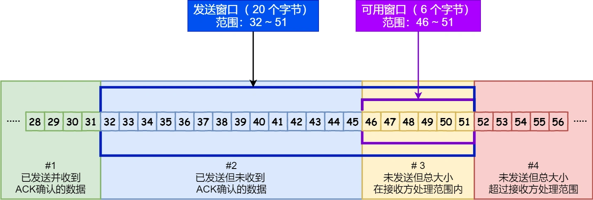
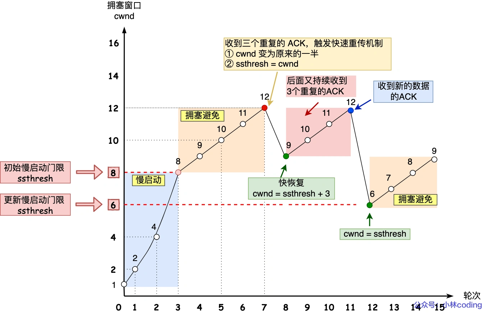

### tcp 如何保证可靠性
大家都知道TCP是可靠性传输协议，既然是可靠的，就需要解决比如包丢失了、数据被破坏了、包重复了、乱序了等等这样的问题。下面将从几个方面介绍TCP的可靠性。

#### 1. 校验和
TCP每一段报文都有校验和，这保证了报文不被破坏或篡改，如果收到的报文在校验过程中有差错，TCP 将丢弃这个报文段和不确认收到此报文段。

#### 2.序列号与确认应答
TCP发送的每一个包都有一个序列号，这可以让接收方知道自己已经接收到了那些包，哪些包丢失了，重复的包也可以根据序号丢弃，并且根据序号将包排序，同时每一个发送的包都会返回一个确认应答消息，来确保消息被接收。

#### 3.重传机制

TCP 实现可靠传输的方式之一，是通过序列号与确认应答，当发送端的数据到达接收主机时，接收端主机会返回一个确认应答消息，表示已收到消息，如果数据包丢失了，就会用重传机制解决。
重传机制分为超时重传、快速重传、SACK、D-SACK

-  **超时重传** ：在发送数据时，设定一个定时器，当超过指定的时间后，没有收到对方的 ACK 确认应答报文，就会重发该数据。超时时间被称为RTO，一般略大于RTT，不过RTO是一个动态值，具体如何计算，有兴趣的可以自行查询。如果重传的包又超时了，那么再次重传时间隔为上一次代分倍数；即每当遇到一次超时重传的时候，都会将下一次超时时间间隔设为先前值的两倍。两次超时，就说明网络环境差，不宜频繁反复发送。

-  **快速重传** ：超时重传的问题是要等超时时间后才会重传。快速重传不以时间为驱动，而是以数据驱动重传，服务器如果收到乱序的包，也给客户端回复 ACK，比如收到乱序的包 6,7,8,9 时，服务器全都发 ACK = 5，这样客户端就知道5丢失了，当客户端收到三个相同的 ACK 报文时，会在超时之前，重传丢失的报文段，而不需要等到计时器超时。

-  **SACK 选择性确认** ：快速重传只解决了超时时间的问题，假如有1~9个包要传，其中4和5丢失了，服务端收到了6~9的包后，都只给客户端响应缺少4，客户端这时有两种选择：1.重传单个包，这个时候只会重传4，再次等到三个ACK后才会重传5，这样效率就会很低；2.重传4之后的所有包，由于服务端已经收到6~9，重传一次就会造成资源的浪费。于是就有了选择性确认这种机制，这种方式需要在 TCP 头部 选项（在上一章节的TCP头部报文格式中有介绍） 字段里加一个 SACK 的选项，它可以将已收到的数据的信息发送给「发送方」，这样发送方就可以知道哪些数据收到了，哪些数据没收到，知道了这些信息，就可以只重传丢失的数据

#### 4.滑动窗口
TCP 是每发送一个数据，就需要等待对方进行ACK确认应答，这显然会极大的影响传输的速率。在发送数据的时候，最好的方式是一下将所有的数据全部发送出去，然后一起确认。于是就引入了窗口的概念，这个所谓的窗口实际上是操作系统开辟的一个缓存空间，发送方在等到确认应答返回之前，必须在缓冲区中保留已发送的数据。如果按期收到确认应答后，此时数据就可以从缓存区清除，同样接收方接收数据后也是放在这个缓存区中的，那么接收方缓存区还能接收多少数据，这个就是决定窗口大小的因素，如果发送方的数据超过接收方缓存区的大小，那会造成接收方数据溢出，这就会导致数据丢失。所以，通常窗口的大小是由接收方的窗口大小来决定的。发送方发送的数据大小不能超过接收方的窗口大小，否则接收方就无法正常接收到数据。

 **发送方的滑动窗口** 

- 1是已发送并收到 ACK确认的数据
- 2是已发送但未收到 ACK确认的数据
- 3是允许发送但尚未发送的数据，总大小在接收方处理范围内
- 4是不允许发送的数据，总大小超过接收方处理范围

滑动窗口并不是固定的，它主要是根据接收方的接收情况，动态去调整窗口大小，然后来控制发送方的数据流量

 **零窗口** 

在接收方窗口大小变为0的时候，发送方就不能再发送数据了。但是当接收方窗口恢复的时候发送方要怎么知道那？在这个时候TCP会启动一个零窗口（TCP Zero Window）定时探测器，向接收方询问窗口大小，当接收方窗口恢复的时候，就可以再次发送数据

#### 流量控制
发送方不能无限制的发数据给接收方，也要考虑接收方的处理能力，如果一直无限制的发数据给对方，但对方处理不过来，那么就会导致触发重发机制，从而导致网络流量的无端的浪费。为了解决这种现象发生，TCP 提供一种机制可以让「发送方」根据「接收方」的实际接收能力控制发送的数据量，这就是所谓的流量控制。流量控制由滑动窗口协议实现，滑动窗口既保证了分组无差错、有序接收，也实现了流量控制。主要的方式就是接收方返回的 ACK 中会包含自己的接收窗口的大小，并且利用大小来控制发送方的数据发送。

#### 拥塞控制
有了流量控制为什么还需要拥塞控制？

流量控制：流量控制是针对接收者的，它是控制发送者的发送速度从而使接收者来得及接收，防止分组丢失的。即防止发送方的数据填满接收方的缓存区。

拥塞控制：拥塞控制是作用于网络的，它是防止过多的数据注入到网络中，避免出现网络负载过大的情况。即防止发送方的数据填满整个网络

在网络出现拥堵时减少数据包的发送，网络恢复后它又会增加数据包的发送，这就是拥塞控制。

拥塞窗口cwnd：是发送方维护的一个的状态变量，它会根据网络的拥塞程度动态变化的，只要网络中没有出现拥塞，拥塞窗口就会变大，当网络中出现了拥塞它就会变小。

如何知道网络拥塞？

只要发送方没有在规定时间内接收到 ACK 应答报文，也就是发生了超时重传，就会认为网络出现了拥塞。

拥塞控制算法：

- 慢启动：TCP 在刚建立连接完成后并不知道网络情况，它会一点一点的提高发送数据包的数量来试探网络的情况，它的主要原理就是：当发送方每收到一个 ACK，拥塞窗口 cwnd 的大小就会加 1。当然也不可能无限制的增加拥塞窗口 cwnd 的大小，有一个叫慢启动门限 ssthresh （slow start threshold）状态变量，当cwnd 小于该值时就增加，大于等于该值时就会启动拥塞避免算法。慢开始算法只是在TCP连接建立时和网络出现超时时才使用

- 拥塞避免算法：进入拥塞避免算法后，它的规则是：每当收到一个 ACK 时，拥塞窗口cwnd 增加 1/cwnd，假设cwnd现在是8，那么进入拥塞避免算法后，收到ACK时，它增加了1/8。也就是说增长变的缓慢了，即使缓慢的增长，它也是无限制的，这样网络就会慢慢进入了拥塞的状况，当出现包丢失，触发重传机制的时候，就进入了拥塞发生算法。

- 拥塞发生算法：当网络出现拥塞，也就是会发生数据包重传，触发重传机制，前面我们知道重传机制分为超时重传和快速重传两种情况，当发生了超时重传时才会使用拥塞发生算法，此时它会将ssthresh 设置为cwnd/2 ，并将cwnd 重置为初始值。接着，就重新开始慢启动，慢启动是会突然减少数据流的。这种方式太激进会造成网络卡顿。当发生快速重传时，TCP 认为这种情况不严重，因为大部分没丢，只丢了一小部分，则 ssthresh 和 cwnd 变化如下，cwnd = cwnd/2 ，也就是设置为原来的一半;ssthresh = cwnd。进入快速恢复算法

- 快速恢复算法： 快速重传和快速恢复算法一般同时使用，进入快速恢复算法后，拥塞窗口 cwnd = ssthresh + 3，重传丢失的数据包。快速恢复是针对拥塞发生后对慢启动的优化。

### tcp 粘包问题