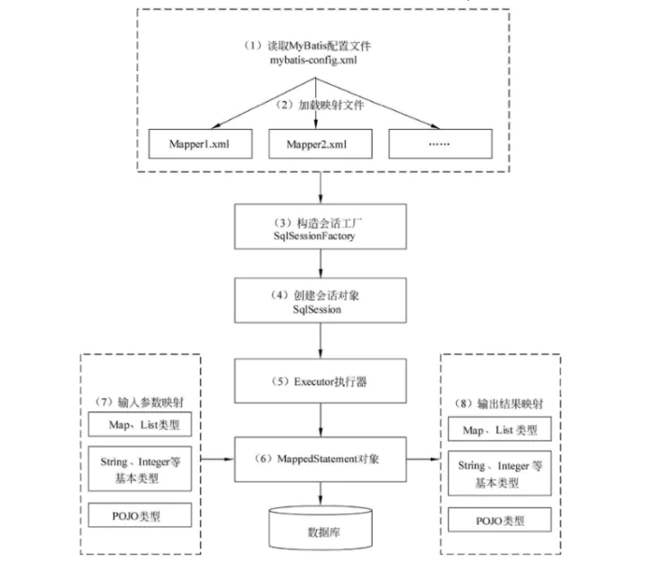

### 为什么要是用 MyBatis?

- MyBatis 是一个半自动的持久化框架。
- SQL与业务分离，功能边界清晰，当需要优化的时候，懂SQL的人比如DBA，直接看我们的SQL就够了，而不需要关注我们的业务代码。
- 因为是直接的SQL语句，不需要像Hibernate和JPA那样需要解析成数据库的SQL，性能也就相对较高。

###  #{} 和 ${} 的区别

- #{}：是以预编译的形式，将参数设置到 sql 语句中
- ${}：取出的值直接拼装在 sql 语句中；会有安全问题（SQL注入）

### MyBatis 中常用的标签有哪些？
- select 对应查询语句，可以包含属性parameterType（参数），resultType 或resultMap （返回值）
- insert 对应插入语句
- delete 对应删除语句
- update 对应更新语句
- if 通常用于WHERE语句、UPDATE语句、INSERT语句中，通过判断参数值来决定是否使用某个查询条件、判断是否更新某一个字段、判断是否插入某个字段的值
- foreach 主要用于构建in条件，可在sql中对集合进行迭代。也常用到批量删除、添加等操作中
- choose when 多条件判断 类似if else
- sql 当多种类型的查询语句的查询字段或者查询条件相同时，可以将其定义为常量，方便调用
- include 用于引用定义的常量

### 对于不支持主键自增的数据库（Oracle）如何在插入的时候获取主键值

oracle中没有自增长主键，而是sequence序列，插入的时候需要把sequence值放到主键中，这个时候可以使用selectKey标签获取sequence序列或者自定义主键：

```
<insert id="insertUser" parameterType="model.User">
		<selectKey keyProperty="id" resultType="int" order="BEFORE">
			select idseq.nextVal from dual
		</selectKey>
	insert into User
	(id, account,username, password) values
	(#{id}, #{account},#{username}, #{password})
</insert>

```

### MyBatis的工作原理或流程是什么？


如上图，MyBatis主要有以下流程：

- 读取mybatis-config.xml 配置文件，主要是Mybatis 的运行环境等信息，例如数据库连接信息
- 加载映射文件，即 SQL 映射文件，该文件中配置了操作数据库的 SQL 语句
- 构造会话工厂SqlSessionFactory，该工程主要用于创建SqlSession
- 创建会话对象SqlSession，由会话工厂创建 SqlSession 对象，主要用来执行SQL语句，该对象中包含了执行 SQL 语句的所有方法。
- Executor 执行器，Mybatis 底层定义了一个 Executor 接口来操作数据库，它将根据 SqlSession 传递的参数动态地生成需要执行的 SQL 语句，同时负责查询缓存的维护
- MappedStatement 对象，在 Executor 接口的执行方法中有一个 MappedStatement 类型的参数，该参数是对映射信息的封装，用于存储要映射的 SQL 语句的 id、参数等信息
- 输入参数映射，输入参数类型可以是 Map、List 等集合类型，也可以是基本数据类型和 POJO 类型。输入参数映射过程类似于 JDBC 对 preparedStatement 对象设置参数的过程
- 输出结果映射，输出结果类型可以是 Map、 List 等集合类型，也可以是基本数据类型和 POJO 类型。输出结果映射过程类似于 JDBC 对结果集的解析过程。


### MyBatis默认执行器是什么？有哪些执行器？如何指定执行器？

MyBatis 默认的执行器是SimpleExecutor

Mybatis有三种基本的Executor执行器

- SimpleExecutor 每执行一次update或select，就开启一个Statement对象，用完立刻关闭 Statement对象
- ReuseExecutor 执行update或select，以sql作为key查找Statement对象，存在就使用， 不存在就创建，用完后，不关闭Statement对象，而是放置于Map<String, Statement>内， 供下一次使用。简言之，就是重复使用Statement对象
- BatchExecutor 执行update（没有select，JDBC批处理不支持select），将所有sql都添加 到批处理中（addBatch()），等待统一执行（executeBatch()），它缓存了多个Statement 对象，每个Statement对象都是addBatch()完毕后，等待逐一执行executeBatch()批处理。 与JDBC批处理相同

在Mybatis配置文件中，可以指定默认的ExecutorType执行器类型，也可以手动给DefaultSqlSessionFactory的创建SqlSession的方法传递ExecutorType类型参数


### MyBatis支持懒加载（延迟加载）吗？原理是什么？


参考

https://www.zhihu.com/question/48910838

https://www.jianshu.com/p/e3fa66277578
